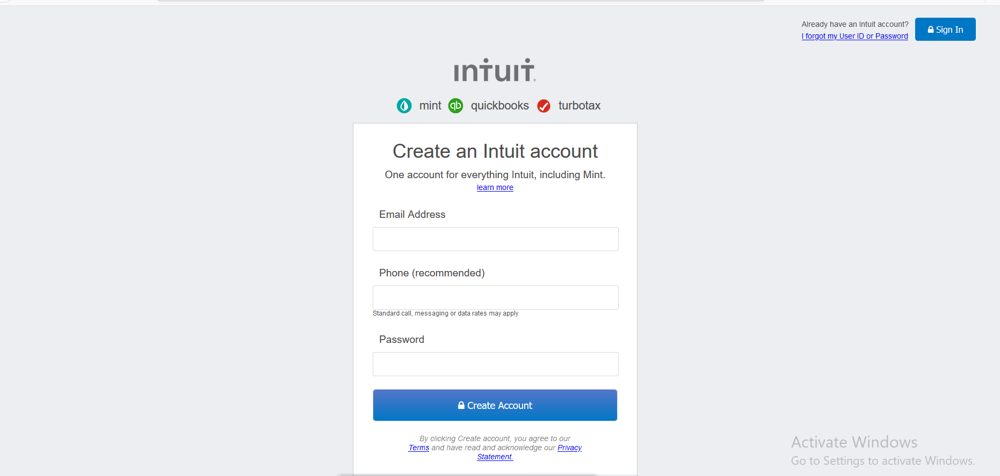

# HTML Forms: Mint Sign Up Form Clone

> This is a microverse student project for working with html forms



> This project clones the mint.com sign up page interface design.
> The project includes the header, the form and the footer as it's main features.

## Built With

- HTML
- CSS

## Live Demo

[Live Demo Link](https://bigwizzo.github.io/html-form/)

## Getting Started

 To get a local copy up and running follow these simple example steps.

### Prerequisites
> Browser
> Text editor of your choice.
> npm has to be installed in your system.
> install linters on your IDE.

### Setup
> ``` git clone https://github.com/BigWizzo/html-form.git ```

### Usage
> Open the index.html from your browser.

### Run tests
Run ``` npx html-validator-cli --quiet --file index.html ``` to run the validator over the ```index.html``` file.

The ```--quiet``` will only list ```errors```. If you also want to see the warnings use the ```--verbose``` flag instead.
As an alternative, you can also install the ```html5validator``` using ```pip```:

``` 
pip install --user html5validator
html5validator index.html
```
## Authors

👤 **Author1**
- Github: [@ojrdev](https://github.com/ojrdev)

👤 **Author2**
- Github: [@bigwizzo](https://github.com/bigwizzo)

## 🤝 Contributing

Contributions, issues and feature requests are welcome!

Feel free to check the [issues page](https://github.com/BigWizzo/html-form/issues).

## Show your support

Give a ⭐️ if you like this project!

## 📝 License

This project is [MIT](lic.url) licensed.